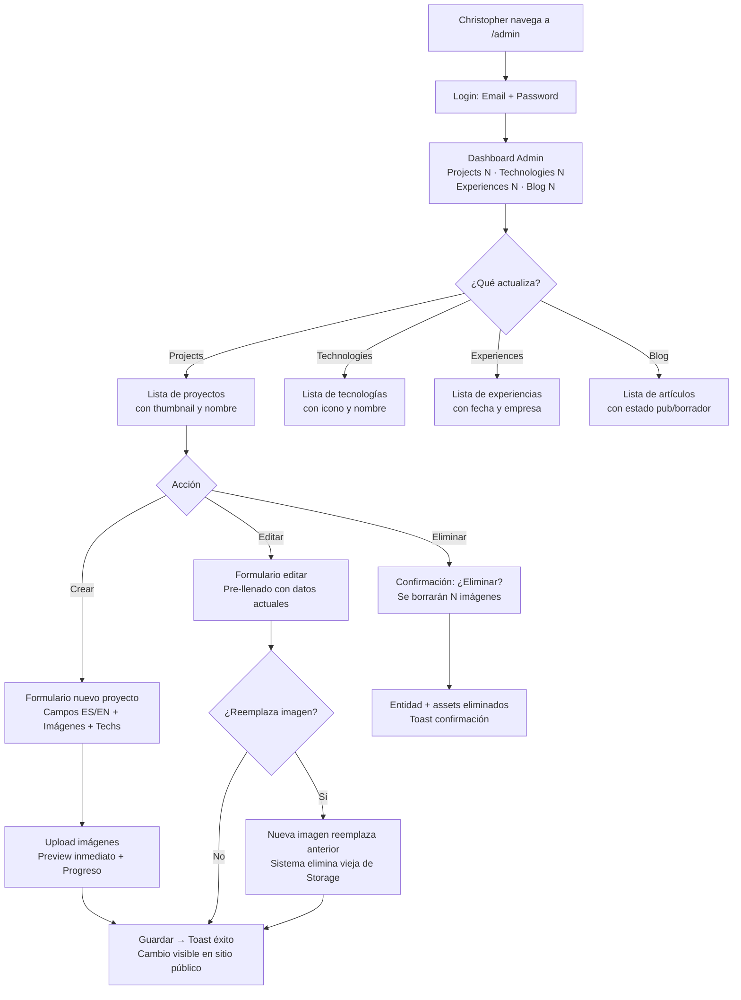
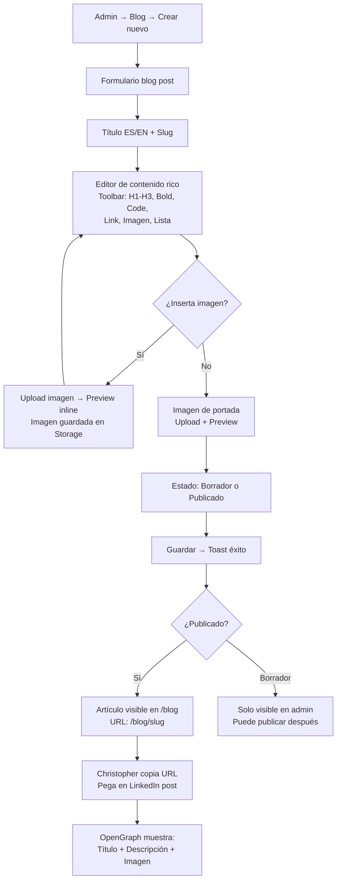

# UX Design Specification portfolio

**Author:** Christopher
**Date:** 2026-03-15

---

## Executive Summary

### Project Vision

Portfolio ChrisBP es la reconstrucción profesional de un portfolio de desarrollador, migrando de Flutter Web a Astro 5. El objetivo UX no es reinventar el diseño visual (que funciona bien) sino resolver problemas fundamentales de experiencia: un sitio invisible a buscadores, un panel de administración poco intuitivo, y la ausencia de un canal de contenido propio (blog). El resultado debe ser un portfolio que funciona como prueba viva de competencia técnica — tanto en la experiencia del visitante como en el código fuente.

### Target Users

**Sarah (Reclutadora/Hiring Manager)** — Visitante único, 2-5 minutos. Necesita evaluar profesionalmente a Christopher en segundos. Prioriza: carga instantánea, diseño profesional, contenido claro y navegable. Su equipo técnico revisará el repositorio.

**Christopher (Admin/Blogger)** — Usuario infrecuente (cada 6-12 meses). Necesita un admin autoexplicativo que funcione sin memoria previa: CRUD de proyectos, tecnologías, experiencias y artículos de blog, con gestión de imágenes robusta. Como blogger, necesita publicar artículos técnicos compartibles en LinkedIn.

**Diego (Dev que clona)** — Usuario secundario. Encuentra el repo en GitHub, lo clona y configura su propio portfolio. Se beneficia de README claro, `.env.example` documentado y código limpio.

### Key Design Challenges

1. **Admin "a prueba de olvido"** — Cada sesión de Christopher en el admin es prácticamente una primera vez. Formularios con campos bilingües (ES/EN), imágenes múltiples y relaciones entre entidades deben sentirse simples sin onboarding. La gestión de imágenes debe prevenir huérfanos de forma transparente.

2. **Primera impresión en 3 segundos** — El portfolio debe comunicar competencia profesional instantáneamente sin parecer un template genérico. Diferenciarse visualmente manteniendo velocidad de carga (<1.5s LCP) y sin sobrecargar.

3. **Transición de identidad visual** — Mantener la marca existente de Christopher (colores `#48A1CD`/`#108385`, Poppins, dark mode por defecto) mientras se aprovechan las capacidades de HTML semántico, Tailwind CSS y animaciones nativas web.

4. **Blog como feature nueva** — Diseño completo desde cero: editor rico en admin, listado público, página de artículo con formato rico, OpenGraph por artículo para compartir en redes sociales.

### Design Opportunities

1. **Narrativa profesional integrada** — El blog (especialmente el primer artículo sobre BMAD + IA) es contenido que demuestra capacidad técnica y storytelling. La UX del blog puede maximizar impacto cuando visitantes llegan desde LinkedIn.

2. **Micro-interacciones que demuestran craft** — Animaciones sutiles, transiciones fluidas, skeleton loaders y feedback visual en operaciones demuestran atención al detalle — exactamente lo que un reviewer técnico busca al evaluar un candidato.

3. **Admin como showcase técnico en código** — Aunque solo Christopher lo usa, la arquitectura del admin (formularios, validación, gestión de estado, ciclo de vida de imágenes) estará visible en el repositorio público, demostrando competencia en áreas que los templates nunca cubren.

## Core User Experience

### Defining Experience

Portfolio ChrisBP tiene dos experiencias core fundamentalmente distintas:

**Sitio público (Sarah):** La acción core es evaluar a Christopher como candidato profesional en segundos. No es navegar un sitio web — es formar un juicio profesional. Todo el diseño debe optimizar para que ese juicio sea positivo y rápido: velocidad de carga, jerarquía visual clara, evidencia tangible de competencia.

**Panel admin (Christopher):** La acción core es actualizar contenido después de meses sin tocar el sistema. No es gestionar un CMS — es retomar confianza con una herramienta olvidada. La UX debe hacer que la primera acción después de meses se sienta tan natural como la última.

### Platform Strategy

- **Web responsive**: Desktop (Sarah desde LinkedIn, Christopher en admin) y móvil (Sarah desde dispositivos)
- **Input**: Mouse/keyboard primario, touch secundario
- **Offline**: No requerido
- **Rendering**: SSR híbrido para sitio público (contenido dinámico desde Firebase sin rebuilds), SPA interactiva con Svelte 5 islands para admin
- **Hosting**: Edge computing (Cloudflare Pages/Vercel) para latencia mínima global
- **Breakpoints**: Mobile (<450px), Tablet (450-900px), Desktop (>900px)

### Effortless Interactions

1. **Navegación del sitio público** — Scroll fluido entre secciones, transiciones imperceptibles entre páginas, filtros de proyectos instantáneos
2. **Cambio de idioma** — Toggle ES/EN sin recarga, contenido cambia inmediatamente
3. **Cambio de tema** — Dark/Light toggle instantáneo con persistencia entre sesiones
4. **Visor de imágenes** — Screenshots en fullscreen con navegación fluida entre imágenes
5. **Formularios admin** — Campos bilingües visualmente diferenciados, upload de imágenes con preview inmediato
6. **Gestión de imágenes** — Reemplazo y eliminación transparentes. El sistema limpia Storage automáticamente sin intervención del usuario
7. **Flujo de publicación de blog** — Escribir → preview → publicar → copiar URL → compartir. Lineal y sin bifurcaciones

### Critical Success Moments

1. **"Este candidato sabe lo que hace"** — Primeros 3 segundos: sitio cargado, diseño profesional, contenido real visible. Si falla, nada más importa.
2. **"Ah, esto es fácil"** — Christopher vuelve al admin tras meses, ve el dashboard, sabe exactamente qué hacer sin recordar nada previo.
3. **"Se ve profesional en mi feed"** — URL del blog post pegada en LinkedIn muestra OpenGraph correcto con título, descripción e imagen. Compartible sin vergüenza.
4. **"El código es tan limpio como el sitio"** — Tech Lead abre el repositorio y encuentra arquitectura organizada, tests, TypeScript strict. El código confirma la impresión del sitio.

### Experience Principles

1. **Velocidad es confianza** — Cada milisegundo de carga es una declaración sobre competencia técnica. El sitio debe sentirse instantáneo, no solo "rápido".
2. **Claridad sobre creatividad** — El portfolio es una herramienta profesional, no un experimento visual. Priorizar legibilidad, jerarquía clara y navegación predecible sobre efectos llamativos.
3. **Autoexplicativo siempre** — Ningún elemento del admin requiere memoria previa ni documentación. Labels claros, estados visibles, acciones obvias.
4. **El detalle habla por ti** — Micro-interacciones, transiciones, feedback visual y edge cases bien resueltos diferencian "profesional" de "template con datos".
5. **Contenido dinámico, experiencia estática** — Los datos cambian, pero la experiencia del visitante siempre se siente pulida y completa, nunca en construcción.

## Desired Emotional Response

### Primary Emotional Goals

**Para Sarah (visitante):**
- **Impresionada pero no abrumada** — El sitio transmite competencia técnica sin ser intimidante. Sarah piensa "este candidato es serio" sin sentirse excluida por jerga técnica.
- **Confianza inmediata** — La velocidad de carga, el diseño pulido y el contenido claro generan confianza profesional. No hay duda de que Christopher sabe lo que hace.

**Para Christopher (admin):**
- **Tranquilidad y control** — Cada acción en el admin tiene feedback claro. Christopher nunca siente incertidumbre sobre si una operación se completó correctamente o si dejó datos inconsistentes.
- **Orgullo** — Al ver el resultado final (sitio público + código fuente), Christopher siente orgullo genuino de mostrarlo a reclutadores, colegas y en su LinkedIn.

### Emotional Journey Mapping

| Momento | Sarah (Visitante) | Christopher (Admin) |
|---|---|---|
| **Primer contacto** | Curiosidad → Impresión positiva | Familiaridad → "Recuerdo esto" |
| **Exploración** | Interés → "Quiero ver más" | Confianza → "Sé cómo hacer esto" |
| **Acción core** | Convicción → "Este candidato destaca" | Satisfacción → "Todo actualizado" |
| **Cierre** | Decisión → Agenda entrevista | Tranquilidad → "Todo limpio y consistente" |
| **Error/problema** | Tolerancia → Recuperación sin frustración | Calma → Mensaje claro, acción obvia |

### Micro-Emotions

**Confianza > Confusión** — Crítico en ambas experiencias. Sarah debe sentir que el sitio es de alguien que sabe lo que hace. Christopher debe sentir que el admin es predecible y no va a romper nada.

**Eficiencia > Exploración** — Tanto Sarah como Christopher tienen objetivos claros. No vienen a "explorar" — vienen a evaluar (Sarah) o actualizar (Christopher). La UX respeta su tiempo.

**Orgullo > Satisfacción** — La emoción objetivo no es "funciona" sino "esto me representa". Christopher debe sentir orgullo al compartir el portfolio, no solo satisfacción de que "está online".

### Design Implications

| Emoción Objetivo | Decisión de Diseño UX |
|---|---|
| **Confianza inmediata** | Carga instantánea (<1.5s), above-the-fold con contenido real (no skeleton vacío), tipografía legible, espaciado generoso |
| **Tranquilidad en admin** | Feedback visual en cada operación (toast/snackbar), confirmación antes de eliminar, indicadores de estado (guardado/guardando/error), preview antes de publicar |
| **Orgullo** | Diseño visual distintivo (no genérico), animaciones sutiles que demuestran craft, OpenGraph pulido para compartir en redes |
| **Eficiencia** | Navegación en <3 clicks a cualquier contenido, formularios sin pasos innecesarios, acciones bulk cuando tiene sentido |
| **Recuperación sin frustración** | Mensajes de error claros y accionables, nunca mostrar stack traces, estados vacíos con guía ("No hay proyectos aún. Crea el primero.") |

### Emotional Design Principles

1. **Feedback inmediato en cada acción** — Ninguna operación del admin ocurre en silencio. Toast de éxito, indicador de progreso en uploads, confirmación visual de guardado.
2. **Progresión visual del contenido** — El sitio público carga de arriba a abajo con contenido real apareciendo fluidamente, no con saltos o layout shifts.
3. **Errores amigables, no técnicos** — "No se pudo subir la imagen. Intenta con un archivo menor a 5MB." en lugar de "Error 413: Payload Too Large".
4. **Celebrar logros silenciosamente** — Al publicar un blog post o completar una actualización, un feedback sutil (checkmark animado, mensaje "Publicado exitosamente") refuerza el sentimiento de logro.

## UX Pattern Analysis & Inspiration

### Inspiring Products Analysis

**1. Stripe.com (Documentación y Portfolio Corporativo)**
- Carga ultra-rápida con transiciones suaves entre secciones
- Jerarquía visual impecable: cada sección tiene un propósito claro
- Código como contenido: snippets integrados que demuestran el producto
- Dark mode profesional que transmite sofisticación técnica
- **Lección para portfolio:** Un sitio técnico puede ser visualmente impactante sin sacrificar claridad

**2. Linear.app (Panel de Administración)**
- Interfaz limpia con densidad de información alta pero legible
- Keyboard-first pero accesible con mouse
- Feedback instantáneo en cada acción (optimistic updates)
- Sidebar de navegación clara con estados activos evidentes
- **Lección para admin:** Un admin puede ser funcional Y visualmente atractivo. La densidad de información no implica desorden.

**3. Notion (Editor de Contenido)**
- Edición de bloques intuitiva sin toolbar complejo visible
- Slash commands para insertar elementos
- Drag & drop para reordenar
- Preview inmediato — lo que ves es lo que obtienes
- **Lección para blog editor:** El editor de blog debe sentirse natural, no como aprender una herramienta nueva.

### Transferable UX Patterns

**Navegación:**
- **Sticky header con scroll-aware behavior** (Stripe) — Header se compacta o cambia de estilo al hacer scroll, manteniendo navegación accesible sin robar espacio
- **Sidebar navigation para admin** (Linear) — Menú lateral persistente con secciones colapsables, mostrando la sección activa claramente

**Interacción:**
- **Optimistic updates en CRUD** (Linear) — Al guardar un proyecto, la UI se actualiza inmediatamente mientras la operación completa en background. Si falla, se revierte con notificación.
- **Inline editing con preview** (Notion) — Los campos del blog se editan directamente con formato visible, no en un textarea plano separado del resultado final.

**Visual:**
- **Gradientes sutiles como identidad** (Stripe) — Usar los colores de marca (#48A1CD/#108385) como gradientes sutiles en headers, borders y acentos, no como fondos sólidos agresivos.
- **Cards con hover elevation** — Proyectos y blog posts como cards con elevación sutil en hover, invitando a hacer click.

### Anti-Patterns to Avoid

1. **Portfolio "museo estático"** — Portfolios donde el contenido se siente como una exposición inmóvil. Evitar: páginas sin interactividad, imágenes sin visor, proyectos sin links a código/demo.
2. **Admin "formulario infinito"** — Formularios con 20+ campos en una sola vista sin organización. Evitar: no agrupar campos lógicamente, no usar tabs o secciones colapsables para formularios complejos.
3. **Animaciones que bloquean** — Animaciones de entrada que el usuario debe esperar antes de ver contenido. Evitar: no usar animaciones que retrasen el acceso a información (hero animations que duran 2s antes de mostrar contenido).
4. **Dark mode que sacrifica legibilidad** — Contraste insuficiente en temas oscuros. Evitar: texto gris claro sobre fondo gris oscuro que no pasa WCAG AA.
5. **Toast notifications ignorables** — Notificaciones de éxito/error que desaparecen antes de ser leídas. Evitar: toasts de <2s en operaciones importantes.

### Design Inspiration Strategy

**Adoptar directamente:**
- Sticky header scroll-aware (Stripe) — soporta navegación eficiente en sitio público
- Sidebar admin con estados activos (Linear) — reemplaza el admin drawer oculto actual
- Cards con hover states para proyectos y blog (patrón universal)
- Feedback visual inmediato en operaciones CRUD (Linear)

**Adaptar al contexto:**
- Editor de blog inspirado en Notion pero simplificado — sin slash commands ni drag & drop, usar toolbar visible compacta con las acciones necesarias (headings, bold, code, imagen, link)
- Gradientes de marca sutiles — adaptar el patrón Stripe usando #48A1CD/#108385 como acentos, no como elemento dominante

**Evitar:**
- Sobre-animación que compita con el contenido
- Admin con densidad tipo Linear completo (Christopher no es un usuario diario, necesita más espacio y claridad)
- Editor tipo Notion completo (excesivo para blog posts técnicos)

## Design System Foundation

### Design System Choice

**Tailwind CSS 4 + Componentes custom con Svelte 5** — Sistema themeable con foundation sólida y control total.

Esta no es una decisión entre frameworks de componentes prediseñados. El stack objetivo (Astro 5 + Tailwind CSS 4 + Svelte 5 islands) define una estrategia de design system basada en utility-first CSS con componentes custom construidos sobre tokens de diseño consistentes.

### Rationale for Selection

1. **Control total sobre la identidad visual** — Un portfolio profesional necesita diferenciación visual. Componentes prediseñados de Material UI o Chakra generan familiaridad con "aplicación genérica", no con "portfolio que demuestra competencia".
2. **Consistencia con el stack** — Tailwind CSS 4 es parte del stack definido en el PRD. Construir sobre Tailwind tokens garantiza que los design tokens fluyen directamente a la implementación sin capas de abstracción.
3. **Performance** — Tailwind purga CSS no utilizado, produciendo bundles mínimos. Componentes de librerías UI agregan JavaScript innecesario para un sitio mayormente estático.
4. **1 desarrollador** — Christopher es el único dev. Un sistema de componentes custom pequeño y enfocado es más mantenible que aprender y customizar una librería externa completa.
5. **Inventario existente como referencia** — Los 73+ componentes del portfolio Flutter actual proveen un inventario claro de qué se necesita. No hay incertidumbre sobre el alcance de componentes.

### Implementation Approach

**Design Tokens en Tailwind Config:**
- Colores de marca (#48A1CD, #108385) como tokens semánticos (`primary`, `primary-dark`)
- Escala tipográfica basada en Poppins con clamp() para responsive
- Sistema de espaciado 4px base (4, 8, 12, 16, 24, 32, 48, 64, 96)
- Breakpoints custom: 450px (mobile), 900px (desktop)
- Sombras, bordes y radios como tokens

**Componentes Svelte 5:**
- Islands interactivas para: toggle tema, toggle idioma, filtros de proyectos, formularios admin, editor de blog, visor de imágenes
- Componentes Astro para: layouts, cards, headers, footers, secciones estáticas

### Customization Strategy

- **Dark mode como default** — `prefers-color-scheme: dark` como base, light como alternativa. Ambos temas definidos como variantes de Tailwind con tokens semánticos.
- **Gradientes de marca** — Gradiente lineal #48A1CD → #108385 como elemento de identidad en headers, borders y acentos.
- **Componentes mínimos pero completos** — Cada componente cubre todos sus estados (default, hover, active, disabled, loading, error) desde el día 1. No hay estados "pendientes".

## Defining Core Experience

### Defining Experience Statement

**"Muestra quién eres como profesional en 3 segundos, y mantén tu historia actualizada sin fricción."**

El portfolio de Christopher es dos productos en uno:
- Un **escaparate profesional instantáneo** para Sarah (visitante)
- Una **herramienta de mantenimiento autoexplicativa** para Christopher (admin)

Ambas experiencias comparten un principio: **cero fricción entre intención y resultado**. Sarah quiere evaluar → ve evidencia inmediata. Christopher quiere actualizar → la interfaz le dice exactamente cómo.

### User Mental Model

**Sarah (visitante):** Llega con el modelo mental de "revisar un CV visual". Espera encontrar: quién es esta persona, qué ha construido, qué tecnologías domina, y cómo contactarlo. Su navegación es lineal-exploratoria: escanea de arriba a abajo, profundiza en lo que le interesa (proyectos), y decide. No espera sorpresas — espera claridad.

**Christopher (admin):** Llega con el modelo mental de "actualizar una base de datos con interfaz gráfica". Espera ver: listas de entidades existentes, botón para crear nuevo, formulario para editar, botón para eliminar. Su flujo es CRUD clásico: listar → seleccionar → editar → guardar. Lo que no espera (y necesita): que el sistema gestione imágenes huérfanas automáticamente sin que él piense en Storage.

**Christopher (blogger):** Modelo mental de "escribir un post de blog como en Medium/Dev.to". Espera: editor con formato, preview del resultado, publicar cuando esté listo, obtener URL para compartir. No espera complejidad de CMS.

### Success Criteria

| Experiencia | El usuario dice... | Indicador Medible |
|---|---|---|
| Sitio público cargado | "Se ve profesional" | LCP <1.5s, CLS <0.05, diseño above-the-fold completo |
| Navegación de proyectos | "Encuentro lo que busco" | <3 clicks a cualquier proyecto, filtros funcionales |
| Admin después de meses | "Ya recuerdo cómo funciona" | 0 clics de exploración antes de la primera acción útil |
| Crear/editar proyecto | "Fue rápido y no rompí nada" | Operación completa <3 min, 0 assets huérfanos |
| Publicar blog post | "Ya está en LinkedIn" | Escribir → publicar → compartir en <15 min |
| Visor de imágenes | "Se ven bien las screenshots" | Transición fluida, carga lazy, navegación con flechas/swipe |

### Novel UX Patterns

El portfolio usa **patrones establecidos con ejecución superior**, no innovación radical:

**Patrones establecidos adoptados:**
- Sticky header con navegación (universal en portfolios)
- Cards para proyectos y blog posts (patrón conocido)
- Timeline para experiencia laboral (patrón esperado)
- Sidebar de admin con CRUD lists (patrón de CMS)
- Formularios con validación inline (patrón estándar)

**Twist único — Campos bilingües como primera clase:**
Los formularios del admin muestran campos ES/EN lado a lado (desktop) o en tabs (mobile), con labels de idioma claros y coloreados. Esto no es un "campo extra" — es una característica visual prominente que comunica inmediatamente: "este contenido existe en dos idiomas".

**Twist único — Gestión de imágenes con ciclo de vida visible:**
El componente de imagen del admin muestra el estado actual (nueva, subida, por reemplazar, por eliminar) con indicadores visuales claros. Christopher no necesita entender Storage — ve colores: verde (nueva), azul (existente), naranja (cambiará), rojo (se eliminará).

### Experience Mechanics

**Sitio Público — Flujo de Sarah:**

1. **Initiation:** Sarah hace click al link desde LinkedIn/CV. El sitio carga en <1.5s mostrando above-the-fold completo: nombre, rol, foto, y CTA visual hacia proyectos.
2. **Interaction:** Scroll down revela secciones progresivamente: About → Technologies → Projects destacados → Experience. Cada sección es autocontenida. Click en proyecto abre detalle con screenshots, descripción, tecnologías y links.
3. **Feedback:** Hover states en cards (elevación sutil), transiciones suaves entre secciones, filtros de proyectos responden instantáneamente.
4. **Completion:** Sarah tiene información suficiente para decidir. CTA de contacto visible en footer y en sección Contact. Si comparte el portfolio, OpenGraph se ve profesional.

**Admin — Flujo de Christopher:**

1. **Initiation:** Navega a `/admin`. Login con email/password. Dashboard muestra las 4 secciones con contadores: Projects (N), Technologies (N), Experiences (N), Blog (N).
2. **Interaction:** Click en sección → lista de entidades. Click en "Crear nuevo" → formulario con campos organizados por secciones. Campos bilingües lado a lado. Upload de imágenes con drag & drop y preview.
3. **Feedback:** Toast de confirmación al guardar ("Proyecto guardado exitosamente"). Indicador de progreso en upload de imágenes. Confirmación antes de eliminar ("¿Eliminar 'Nombre'? Se eliminarán también N imágenes de Storage.").
4. **Completion:** Christopher ve los cambios reflejados inmediatamente en el sitio público (SSR, no requiere rebuild). Sale del admin con confianza de que todo está limpio.

## Visual Design Foundation

### Color System

**Paleta Principal — Identidad ChrisBP:**

| Token | Light Mode | Dark Mode | Uso |
|---|---|---|---|
| `primary` | #48A1CD | #48A1CD | Acentos principales, links, botones primarios |
| `primary-dark` | #108385 | #108385 | Gradientes, hover states, bordes activos |
| `background` | #FAFBFC | #0F1419 | Fondo principal |
| `surface` | #FFFFFF | #1A1F2E | Cards, modales, formularios |
| `surface-elevated` | #F5F7FA | #242938 | Elementos elevados, hover cards |
| `text-primary` | #1A1F2E | #E8ECF1 | Texto principal |
| `text-secondary` | #5A6270 | #8B95A5 | Texto secundario, labels |
| `text-muted` | #8B95A5 | #5A6270 | Texto terciario, placeholders |
| `border` | #E2E6EB | #2D3344 | Bordes de cards, separadores |
| `success` | #10B981 | #34D399 | Operaciones exitosas, publicado |
| `warning` | #F59E0B | #FBBF24 | Advertencias, borrador |
| `error` | #EF4444 | #F87171 | Errores, eliminar |

**Gradiente de Marca:**
`linear-gradient(135deg, #48A1CD, #108385)` — Usado en: header accent line, border de cards en hover, botones primarios, tags de tecnología.

**Contraste WCAG AA:**
- Texto primary sobre background: >7:1 (ambos temas)
- Texto secondary sobre background: >4.5:1 (ambos temas)
- Primary sobre surface: >4.5:1 (verificado)

### Typography System

**Fuente principal: Poppins** (continuidad con la marca actual)

| Token | Tamaño | Peso | Line Height | Uso |
|---|---|---|---|---|
| `display` | clamp(2rem, 5vw, 3.5rem) | 700 | 1.1 | Nombre en hero, títulos de página |
| `heading-1` | clamp(1.5rem, 3vw, 2.25rem) | 600 | 1.2 | Títulos de sección (About, Projects, etc.) |
| `heading-2` | clamp(1.25rem, 2.5vw, 1.75rem) | 600 | 1.3 | Subtítulos, nombres de proyecto |
| `heading-3` | clamp(1.1rem, 2vw, 1.375rem) | 500 | 1.4 | Títulos de card, labels de sección admin |
| `body` | 1rem (16px) | 400 | 1.6 | Texto de párrafo, descripciones |
| `body-small` | 0.875rem (14px) | 400 | 1.5 | Metadata, fechas, tags |
| `caption` | 0.75rem (12px) | 400 | 1.4 | Labels de formulario, helpers |
| `code` | 0.875rem (14px) | 400 (mono) | 1.5 | Code blocks en blog (JetBrains Mono o Fira Code) |

**Fuente monoespaciada para blog:** JetBrains Mono o Fira Code — para code blocks y inline code en artículos técnicos.

### Spacing & Layout Foundation

**Sistema de espaciado base 4px:**

| Token | Valor | Uso |
|---|---|---|
| `space-1` | 4px | Padding mínimo interno, gap entre iconos y texto |
| `space-2` | 8px | Padding de chips/badges, gap en inline elements |
| `space-3` | 12px | Padding de inputs, gap en form fields |
| `space-4` | 16px | Padding de cards, margin entre párrafos |
| `space-6` | 24px | Gap entre secciones internas, padding de contenedores |
| `space-8` | 32px | Margin entre componentes principales |
| `space-12` | 48px | Separación entre secciones de página |
| `space-16` | 64px | Separación mayor entre secciones hero |
| `space-24` | 96px | Separación entre secciones top-level del sitio público |

**Layout Grid:**
- **Max-width contenido**: 1200px centrado
- **Max-width texto**: 720px (lectura óptima en blog)
- **Columnas**: CSS Grid con auto-fill/auto-fit para grids de proyectos y tecnologías
- **Sidebar admin**: 250px fijo, contenido fluido

**Componentes de layout:**
- `Container` — Max-width centrado con padding horizontal responsive (16px mobile, 24px tablet, 32px desktop)
- `Section` — Separación vertical consistente entre secciones (48px mobile, 96px desktop)
- `Grid` — Auto-responsive para cards (min 300px por card)

### Accessibility Considerations

- **Contraste**: Todos los pares texto/fondo cumplen WCAG AA (4.5:1 normal, 3:1 grande)
- **Font sizing**: Base 16px, nunca menor a 12px, escalado con clamp() para responsive
- **Focus indicators**: Outline visible (2px solid primary) en todos los elementos interactivos, visible en ambos temas
- **Touch targets**: Mínimo 44x44px para todos los elementos clickeables en mobile
- **Reducción de movimiento**: `prefers-reduced-motion: reduce` desactiva animaciones no esenciales
- **High contrast mode**: Soporte nativo con tokens semánticos que respetan forced-colors

## Design Direction Decision

### Design Directions Explored

Dado que este es un proyecto de migración con identidad visual existente, la exploración de direcciones se enfoca en cómo adaptar la identidad ChrisBP al nuevo stack, no en reinventar la marca:

**Dirección A: "Minimal Professional"** — Espaciado generoso, contenido prominente, mínima decoración. Dark mode con acentos de gradiente solo en elementos interactivos. Cards sin borde, separadas por espacio.

**Dirección B: "Technical Craft"** — Elementos sutiles que sugieren código/ingeniería: monospaced font en subtítulos, grid lines sutiles como fondo, cards con bordes definidos y hover states con gradiente. Dark mode como principal con light mode como alternativa limpia.

**Dirección C: "Dynamic Storytelling"** — Secciones con transiciones scroll-based, imágenes prominentes, hero section con animación sutil de gradiente. Más visual, menos espaciado vacío. Riesgo: puede sentirse como template.

### Chosen Direction

**Dirección B: "Technical Craft"** con elementos de la Dirección A.

La combinación toma lo mejor de ambas: el espaciado generoso y la claridad de "Minimal Professional" con los detalles de craft de "Technical Craft" que comunican competencia técnica sin decirlo explícitamente.

### Design Rationale

1. **Comunica competencia sin palabras** — Detalles como monospaced font en metadata, grid lines sutiles, y hover states precisos dicen "este desarrollador cuida los detalles" antes de que Sarah lea una sola línea.
2. **Dark mode como statement** — El dark mode por defecto (continuando la tradición del portfolio actual) dice "este es un sitio de un developer", no un sitio corporativo genérico.
3. **Espaciado generoso** — Resiste la tentación de llenar cada pixel. El espacio vacío comunica confianza y profesionalismo.
4. **Gradientes como acento, no como protagonista** — El gradiente #48A1CD → #108385 aparece en borders de cards en hover, línea de header, y botones CTA. Nunca como fondo de sección completa.

### Implementation Approach

**Sitio público:**
- Hero section: Nombre + Rol + Avatar con gradiente border + CTA sutil
- Secciones: Separadas por espacio (96px), con títulos h2 usando el heading-1 token
- Cards de proyectos: Grid responsive, borde sutil, hover con gradiente border y elevación
- Blog listing: Cards similares a proyectos pero con metadata (fecha, tiempo de lectura, tags)
- Footer: Links sociales, contact info, copyright. Limpio, sin exceso.

**Admin:**
- Sidebar: Fondo surface, 250px, menú con iconos + labels, sección activa con background primary/10%
- Content area: Fondo background, headers con breadcrumb, tablas/listas con bordes sutiles
- Formularios: Cards en surface con campos organizados por secciones, campos bilingües lado a lado con labels de color (azul ES, verde EN)
- Actions: Botón primario (gradiente) para guardar, secundario (outline) para cancelar, rojo para eliminar

## User Journey Flows

### Journey 1: Sarah Evalúa el Portfolio

```mermaid
flowchart TD
    A[Sarah hace click al link<br/>desde LinkedIn/CV] --> B[Sitio carga <1.5s<br/>Hero: Nombre + Rol + Avatar]
    B --> C{¿Interesada?}
    C -->|Scroll down| D[About Me: Descripción breve<br/>+ Skills destacados]
    C -->|No| X[Sale del sitio]
    D --> E[Technologies: Grid visual<br/>de tecnologías con iconos]
    E --> F[Projects: Cards de<br/>3 proyectos destacados]
    F --> G{¿Quiere ver más?}
    G -->|Click "See All"| H[/projects: Catálogo completo<br/>con filtros por tecnología]
    G -->|Click proyecto| I[/projects/slug: Detalle<br/>Screenshots + Descripción + Links]
    I --> J{¿Quiere ver screenshots?}
    J -->|Click imagen| K[Image Viewer: Fullscreen<br/>con navegación]
    K --> I
    G -->|Scroll down| L[Experience: Timeline laboral]
    L --> M[Blog: Artículos recientes]
    M --> N{¿Lee artículo?}
    N -->|Click| O[/blog/slug: Artículo completo<br/>con formato rico]
    N -->|No| P[Contact / Footer]
    O --> P
    H --> I
    P --> Q{Decisión}
    Q -->|Positiva| R[Contacta a Christopher<br/>o comparte con Tech Lead]
    Q -->|Repo review| S[Tech Lead revisa GitHub<br/>Código limpio + Tests]
    S --> R
```

### Journey 2: Christopher Actualiza Contenido



### Journey 3: Christopher Publica Blog Post



### Journey Patterns

**Patrón CRUD consistente:**
Todas las entidades (Projects, Technologies, Experiences, Blog) siguen el mismo flujo: Lista → Crear/Editar/Eliminar → Feedback → Regreso a lista. La consistencia significa que Christopher aprende el patrón una vez y lo aplica a las 4 secciones.

**Patrón de feedback:**
Toda acción mutadora tiene 3 fases visibles: (1) Indicador de progreso, (2) Resultado (éxito o error), (3) Estado actualizado en la lista. Nunca hay silencio después de una acción.

**Patrón de confirmación destructiva:**
Eliminar siempre requiere confirmación explícita con información de impacto ("Se eliminarán también 5 imágenes de Storage"). Nunca eliminar con un solo click.

### Flow Optimization Principles

1. **Mínimos pasos a valor** — Crear un proyecto: abrir formulario → llenar → subir imágenes → guardar. 4 pasos, no 8.
2. **Feedback optimista** — La UI se actualiza inmediatamente al guardar, sin esperar la respuesta del servidor. Si falla, se revierte con notificación.
3. **Defaults inteligentes** — Slug auto-generado desde el título, estado "borrador" por defecto en blog, fecha actual pre-llenada en experiencias.
4. **Bulk operations donde tiene sentido** — Subir múltiples screenshots a la vez, no una por una.
5. **Salida segura** — Si Christopher cierra el formulario sin guardar y hay cambios, confirmar "¿Descartar cambios?".

## Component Strategy

### Design System Components

**Componentes base de Tailwind (no requieren Svelte, son Astro puro):**

| Componente | Uso | Variantes |
|---|---|---|
| `Container` | Wrapper de contenido centrado | default, narrow (blog text), wide (grids) |
| `Section` | Separador de secciones con spacing | default, hero, compact |
| `Card` | Contenedor de contenido elevado | project, blog, technology, experience |
| `Button` | Acciones principales y secundarias | primary (gradiente), secondary (outline), danger (rojo), ghost |
| `Badge` | Tags y estados | technology, status (publicado/borrador), language (ES/EN) |
| `Input` | Campos de formulario | text, textarea, select, file |
| `Typography` | Estilos de texto consistentes | display, h1, h2, h3, body, caption, code |

### Custom Components

**Componentes Svelte 5 (islands interactivas):**

| Componente | Propósito | Estados |
|---|---|---|
| `ThemeToggle` | Switch dark/light mode | dark (activo), light, animación de transición |
| `LocaleToggle` | Switch ES/EN | es (activo), en, con bandera/label |
| `ImageViewer` | Visor fullscreen de screenshots | open, navigating, loading, closed |
| `ImageUploader` | Upload con preview y drag & drop | empty, previewing, uploading (progreso), uploaded, error |
| `BilingualField` | Par de inputs ES/EN lado a lado | default, focused-es, focused-en, error-es, error-en |
| `RichTextEditor` | Editor de blog con toolbar | editing, previewing, saving |
| `ProjectFilter` | Filtro de proyectos por tecnología | all, filtered, no-results |
| `AdminSidebar` | Navegación admin con secciones | expanded, collapsed (mobile), active-section |
| `ConfirmDialog` | Modal de confirmación destructiva | visible, confirming, dismissed |
| `Toast` | Notificaciones de feedback | success, error, warning, info, dismissing |
| `ContactForm` | Formulario de contacto con validación | idle, validating, sending, sent, error |

**Especificación detallada — BilingualField:**

```
Propósito: Mostrar y editar campos en dos idiomas simultáneamente
Anatomy:
  ┌─────────────────────────────────────────────┐
  │ [ES 🇪🇸] Label del campo    [EN 🇺🇸] Label  │
  │ ┌──────────────┐  ┌──────────────┐          │
  │ │ Valor ES     │  │ Valor EN     │          │
  │ └──────────────┘  └──────────────┘          │
  │ Helper text (si aplica)                     │
  └─────────────────────────────────────────────┘
Estados: default | focused-es (border primario en campo ES) |
         focused-en (border primario en campo EN) |
         error (border rojo + mensaje) | disabled
Mobile: Tabs ES/EN en lugar de lado a lado
Accessibility: Labels únicos por campo, aria-describedby para helpers
```

**Especificación detallada — ImageUploader:**

```
Propósito: Subir, previsualizar y gestionar imágenes
Anatomy:
  ┌─────────────────────────────────┐
  │  [📷 Drop image or click]      │  ← empty state
  │  ┌───────────┐                 │
  │  │  Preview   │ [🗑️ Remove]   │  ← uploaded state
  │  └───────────┘                 │
  │  ████████████░░░ 75%           │  ← uploading state
  │  ⚠️ Error: File too large      │  ← error state
  └─────────────────────────────────┘
Estados: empty | dragging-over | previewing | uploading (%) |
         uploaded | replacing | error
Props: accept (image/*), maxSize (5MB), multiple (boolean)
Accessibility: Role button, aria-label, keyboard activatable
```

### Component Implementation Strategy

1. **Astro components primero** — Todo lo que no requiere interactividad se implementa como componente Astro (.astro). Esto incluye: Container, Section, Card, Typography, Badge, layouts.
2. **Svelte 5 islands para interactividad** — Solo se hidratan los componentes que requieren estado del cliente: toggles, formularios, editor, visor de imágenes, filtros.
3. **Tokens compartidos** — Los design tokens de Tailwind (colores, spacing, typography) son la fuente de verdad para ambos tipos de componentes.
4. **Props tipadas** — Todos los componentes usan TypeScript strict para props, garantizando seguridad en compile time.

### Implementation Roadmap

**Fase 1 — Fundación (Bloquea todo lo demás):**
- Container, Section, Typography, Button, Badge
- ThemeToggle, LocaleToggle
- AdminSidebar, Toast, ConfirmDialog

**Fase 2 — Sitio Público:**
- Card (project, blog, technology, experience variants)
- ProjectFilter, ImageViewer, ContactForm
- Header (sticky, scroll-aware), Footer

**Fase 3 — Admin:**
- BilingualField, ImageUploader, Input variants
- CRUD list layouts, form layouts
- RichTextEditor (blog)

## UX Consistency Patterns

### Button Hierarchy

| Nivel | Estilo | Uso | Ejemplo |
|---|---|---|---|
| **Primary** | Gradiente (#48A1CD → #108385), texto blanco, sombra sutil | Acción principal por vista. Solo 1 por pantalla visible. | "Guardar proyecto", "Publicar", "Enviar mensaje" |
| **Secondary** | Outline con border primary, texto primary | Acciones complementarias | "Cancelar", "Ver todos", "Descargar CV" |
| **Danger** | Background error, texto blanco | Acciones destructivas | "Eliminar proyecto" |
| **Ghost** | Sin background, texto primary, hover con background sutil | Acciones terciarias, links de navegación | "Ver código fuente", toggles |

**Reglas:**
- Máximo 1 botón primary visible por viewport
- Danger siempre requiere confirmación (ConfirmDialog)
- Botones en formularios: Primary a la derecha, Secondary a la izquierda
- Touch target mínimo: 44x44px

### Feedback Patterns

| Tipo | Componente | Duración | Comportamiento |
|---|---|---|---|
| **Éxito** | Toast verde con checkmark | 4s auto-dismiss | "Proyecto guardado exitosamente" |
| **Error** | Toast rojo con X | Persist until dismiss | "No se pudo guardar. Verifica tu conexión." + acción retry |
| **Warning** | Toast naranja con ! | 6s auto-dismiss | "Imagen mayor a 5MB. Se comprimirá automáticamente." |
| **Loading** | Spinner inline o skeleton | Hasta completar | Reemplaza el contenido que está cargando, no overlay global |
| **Progreso** | Barra de progreso en upload | Hasta completar | Muestra porcentaje en uploads de imágenes |
| **Confirmación** | ConfirmDialog modal | Until user action | "¿Eliminar 'Nombre'? Esta acción no se puede deshacer." |

**Reglas:**
- Nunca mostrar spinners globales que bloqueen toda la UI
- Skeleton loaders para contenido que tarda >300ms
- Toasts se apilan verticalmente si hay múltiples (max 3 visibles)

### Form Patterns

**Estructura de formularios admin:**

```
┌─────────────────────────────────────┐
│ Título del formulario               │
├─────────────────────────────────────┤
│ Sección: Información Básica         │
│ ┌─ Nombre ES ─┐ ┌─ Nombre EN ─┐   │
│ └──────────────┘ └──────────────┘   │
│ ┌─ Descripción ES ─────────────┐   │
│ └──────────────────────────────┘    │
│ ┌─ Descripción EN ─────────────┐   │
│ └──────────────────────────────┘    │
├─────────────────────────────────────┤
│ Sección: Imágenes                   │
│ [Imagen principal] [+ Screenshots]  │
├─────────────────────────────────────┤
│ Sección: Metadata                   │
│ [Tecnologías] [URLs]                │
├─────────────────────────────────────┤
│        [Cancelar]  [Guardar]        │
└─────────────────────────────────────┘
```

**Reglas:**
- Campos agrupados por secciones lógicas con headers
- Validación inline al perder focus (no al submit)
- Mensajes de error debajo del campo, no en un banner global
- Labels siempre visibles (no como placeholder que desaparece)
- Campos obligatorios marcados con asterisco
- Campos bilingües: labels con badge de idioma coloreado (ES azul, EN verde)

### Navigation Patterns

**Sitio público:**
- **Header**: Sticky top, logo izquierda, menú derecha (desktop) / hamburger (mobile)
- **Menú items**: Home, Projects, Experience, Blog, Contact
- **Active state**: Underline con gradiente en el item activo
- **Mobile menu**: Overlay fullscreen con items centrados, animación slide-down
- **Footer**: Links rápidos, redes sociales, copyright
- **Back to top**: Botón flotante que aparece al hacer scroll >50vh

**Admin:**
- **Sidebar**: Fija a la izquierda (desktop), drawer retráctil (mobile)
- **Sidebar items**: Icono + Label, background sutil en activo
- **Breadcrumb**: En el header del content area (Admin > Projects > Editar "Nombre")
- **Actions**: Botón "Crear nuevo" siempre visible arriba de la lista

### Additional Patterns

**Empty States:**
Cuando una lista está vacía, mostrar ilustración sutil + mensaje + CTA:
- "No hay proyectos aún. [Crear el primero →]"
- "No hay artículos de blog. [Escribir el primero →]"

**Loading States:**
- Sitio público: Skeleton loaders que imitan la estructura del contenido real
- Admin listas: Skeleton rows (3-5 filas grises pulsantes)
- Formularios: Botón cambia a spinner al guardar, deshabilitando doble-submit

**Error States:**
- Red de red: Banner no-intrusivo "Sin conexión. Los cambios se guardarán cuando se restablezca."
- Error de servidor: Toast con retry button
- Error de validación: Inline en el campo específico, scroll automático al primer error

**Image States (Admin):**

| Estado | Indicador Visual | Significado |
|---|---|---|
| Sin imagen | Área punteada + icono de cámara | Ninguna imagen asignada |
| Imagen existente | Thumbnail con badge azul "Subida" | Imagen ya en Storage |
| Nueva imagen | Thumbnail con badge verde "Nueva" | Imagen local, se subirá al guardar |
| Reemplazando | Thumbnail con badge naranja "Reemplazará" | La anterior se eliminará automáticamente |
| Eliminando | Área tachada con badge rojo "Se eliminará" | Se borrará de Storage al guardar |

## Responsive Design & Accessibility

### Responsive Strategy

**Mobile (<450px):**
- Layout single-column para todo el contenido
- Header: Logo compacto + hamburger menu
- Cards de proyectos: Full-width, stack vertical
- Admin: Sidebar como drawer retráctil, formularios full-width
- Campos bilingües: Tabs ES/EN en lugar de lado a lado
- Tipografía: Escalada hacia abajo con clamp()
- Touch targets: Mínimo 44x44px en todos los elementos interactivos

**Tablet (450-900px):**
- Layout intermedio: 2 columnas para cards de proyectos
- Header: Puede mostrar menú horizontal compacto o hamburger
- Admin: Sidebar colapsable (icono-only) con expand on hover/click
- Campos bilingües: Lado a lado si caben, tabs si no
- Espaciado: Intermedio entre mobile y desktop

**Desktop (>900px):**
- Layout completo: Hasta 3 columnas para cards
- Header: Menú horizontal completo con hover states
- Admin: Sidebar expandida (250px) + content area fluida
- Campos bilingües: Siempre lado a lado
- Hover states: Elevación en cards, tooltips, preview de imágenes
- Max-width contenido: 1200px centrado

### Breakpoint Strategy

**Mobile-first approach** — Los estilos base son para mobile, con media queries que agregan complejidad para pantallas más grandes.

```css
/* Base: Mobile */
.grid-projects { grid-template-columns: 1fr; }

/* Tablet */
@media (min-width: 450px) {
  .grid-projects { grid-template-columns: repeat(2, 1fr); }
}

/* Desktop */
@media (min-width: 900px) {
  .grid-projects { grid-template-columns: repeat(3, 1fr); }
}
```

**Breakpoints en Tailwind config:**

| Breakpoint | Valor | Prefix Tailwind |
|---|---|---|
| Mobile (default) | <450px | (sin prefix) |
| Tablet | ≥450px | `sm:` |
| Desktop | ≥900px | `lg:` |
| Wide | ≥1200px | `xl:` (max-width container) |

### Accessibility Strategy

**Nivel de cumplimiento: WCAG 2.1 AA** (estándar de industria, requerido por el PRD)

**Estructura semántica:**
- `<header>` — Header principal con `<nav>` para menú
- `<main>` — Contenido principal de cada página
- `<section>` — Cada sección del home (About, Technologies, Projects, Experience)
- `<article>` — Cada card de proyecto, cada blog post
- `<footer>` — Footer con links y copyright
- `<aside>` — Sidebar del admin
- Jerarquía de headings: h1 (título de página) → h2 (secciones) → h3 (subsecciones)

**Navegación por teclado:**
- Tab order lógico que sigue el flujo visual
- Skip link "Saltar al contenido" como primer elemento focusable
- Escape cierra modales y menú mobile
- Enter/Space activa botones y links
- Arrow keys navega dentro de componentes (image viewer, dropdown)
- Focus trap en modales (tab no sale del modal mientras está abierto)

**Screen readers:**
- `aria-label` en botones con solo icono (ThemeToggle, LocaleToggle, hamburger)
- `aria-live="polite"` en toasts para anunciar feedback
- `aria-expanded` en menú mobile y sidebar colapsable
- `aria-current="page"` en item de navegación activo
- `alt` text descriptivo en todas las imágenes de contenido
- `role="img"` con `aria-label` para iconos decorativos de tecnologías

**Formularios accesibles:**
- Cada input tiene `<label>` asociado (nunca solo placeholder)
- Errores de validación anunciados con `aria-describedby`
- Campos obligatorios con `aria-required="true"` además del asterisco visual
- Grupos de campos bilingües con `<fieldset>` y `<legend>`

### Testing Strategy

**Automatizado:**
- Lighthouse CI en cada deploy (>95 en Accessibility)
- axe-core integrado en tests E2E de Playwright
- ESLint plugin de accesibilidad para componentes Astro/Svelte

**Manual:**
- Navegación completa solo con teclado (Tab through todas las páginas)
- VoiceOver (macOS/iOS) para validar screen reader experience
- Simulación de daltonismo para verificar que la información no depende solo del color
- Test en dispositivos reales: iPhone SE (mobile pequeño), iPad (tablet), Desktop

### Implementation Guidelines

**Para desarrollo:**
- Usar elementos HTML semánticos antes de ARIA (button > div[role="button"])
- Nunca `outline: none` sin focus indicator alternativo
- Imágenes: `` con alt siempre, `loading="lazy"` para below-the-fold
- Color: Nunca transmitir información solo con color (agregar icono o texto)
- Animaciones: Envolver en `prefers-reduced-motion` media query
- Font: `font-display: swap` para Poppins (evitar FOIT)
- Links: Texto descriptivo (no "click aquí"), distinguibles del texto normal
- Formularios: Error messages persistentes (no solo cambio de color del borde)
